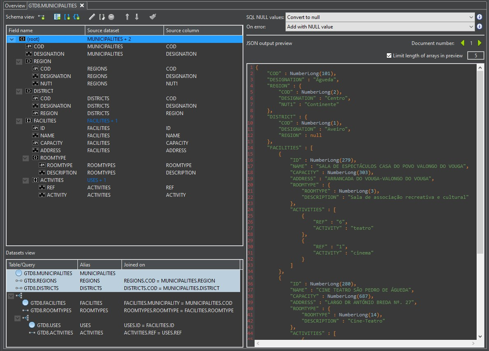

### Steps:

1. Use studio 3T
2. SQL Migration (SQL -> MongoDB Migration)
3. Select the connection on the overview
4. Add import units -> With source table
5. Select GTD8.table.municipalities
6. With GTD8.municipalities selected -> mappings
7. Add 2 one-to-one relationship for district and region
8. Add array to facilities
9. To facilities add one-to-one for roomtype and array for activities (add array for uses and the one-to-on for activites and move out activities to uses and rename uses)

Final result should look like:  

